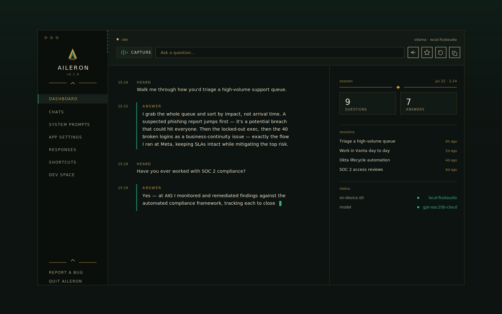

# Assistant 🚀

A lightning-fast, privacy-first AI assistant that works seamlessly during meetings, interviews, and conversations without anyone knowing.



This is a **local-only fork** of the open-source [Pluely](https://github.com/iamsrikanthnani/pluely) project. The hosted cloud API, license activation, auto-updater, and all telemetry have been removed. It runs entirely against your own configured providers — including built-in support for **Ollama** and, on macOS Apple Silicon, **FluidAudio** in-process ASR as the default speech-to-text (no Python server required), with **Whisper**/**Parakeet**/**Nemotron** as advanced local options.

## ✨ Features

- **Stealth Overlay** — translucent, always-available assistant window that's invisible during screen shares and recordings.
- **Bring Your Own Provider** — any LLM or speech-to-text provider configurable via curl, with full streaming support.
- **Ollama by Default** — works out of the box against a local Ollama instance; no API keys required. Detects installed models automatically.
- **Local STT** — **FluidAudio** in-process ASR (CoreML, Apple Silicon) is the default and needs no server. Optionally run Whisper (faster-whisper) or any mlx-audio ASR model (Parakeet TDT v3, Nemotron, etc.) locally for advanced/fully-offline speech-to-text.
- **Real-Time Streaming STT** — local providers that expose a WebSocket endpoint (e.g. Parakeet TDT v3 via `local-parakeet`) support live partial transcriptions. Text appears as you speak, not after. FluidAudio streams final text via Rust events but does **not** expose live partials (text is delivered only when the utterance ends).
- **Audio Capture** — system + microphone audio transcription with VAD.
- **Screenshot Analysis** — capture and send screenshots to your vision-capable model.
- **System Prompts** — create, edit, and switch AI behavior profiles.
- **Customizable** — autostart, app-icon visibility, always-on-top, cursor style, global shortcuts.
- **No Cloud, No Telemetry** — nothing phones home; all requests go directly from your device to your provider.

## 🛠 Tech Stack

- **Frontend:** React 19 + TypeScript 5.8 + Tailwind CSS 4 + Vite 7
- **Desktop:** Tauri 2 (Rust backend)
- **Local AI:** Ollama (`localhost:11434`)
- **Local STT (default):** FluidAudio in-process ASR (CoreML) on macOS 14+ Apple Silicon — no Python server required
- **Local STT (advanced):** faster-whisper (`localhost:8000`) or mlx-audio ASR (`localhost:8001`, default Parakeet TDT v3)

## 📦 Prerequisites

- **macOS 14 (Sonoma) or later on Apple Silicon** for the default FluidAudio STT path. On Intel macOS or other platforms, FluidAudio is unavailable and you must run one of the advanced local STT servers below (or a cloud STT provider).
- [Node.js](https://nodejs.org/) v18+
- [Rust](https://www.rust-lang.org/tools/install) (stable toolchain)
- [Tauri 2 prerequisites](https://tauri.app/start/prerequisites/)
- [Ollama](https://ollama.com/) installed and running

  ```bash
  # Pull a model
  ollama pull llama3.2
  ```

- (Optional, advanced STT only) Python 3.12 for local STT servers. Required only if you want to use `local-whisper`, `local-parakeet`, or `local-nemotron` instead of the built-in FluidAudio default.

  ```bash
  # For faster-whisper STT (all platforms)
  python3.12 -m venv .whisper-venv
  .whisper-venv/bin/pip install faster-whisper fastapi uvicorn python-multipart

  # For mlx-audio STT + parakeet-mlx streaming (Apple Silicon only; supports Parakeet TDT v3 / Nemotron)
  python3.12 -m venv .mlx-asr-venv
  .mlx-asr-venv/bin/pip install "git+https://github.com/Blaizzy/mlx-audio.git" parakeet-mlx fastapi uvicorn python-multipart websockets requests soxr librosa
  ```

## 🚀 Getting Started

```bash
# Clone
git clone <your-repo-url>
cd assistant

# Install frontend dependencies
npm install

# Run in development
npm run tauri dev

# Build for production
npm run tauri build
```

## 🔧 Configuration

1. Start Ollama:
   ```bash
   ollama serve
   ```
2. Launch the app (`npm run tauri dev`).
3. Open the dashboard (`Cmd+Shift+D` / `Ctrl+Shift+D`).
4. The default AI provider is **Ollama** — the app auto-detects installed models. Pick one in **Dev Space → AI Providers**.
5. Configure a **Speech-to-Text** provider in **Dev Space → STT Providers** (Ollama does not provide STT). On macOS Apple Silicon the default is **Local FluidAudio**, which needs no server. On other platforms, pick a cloud STT provider or run one of the local servers below.

### Default STT: FluidAudio (macOS Apple Silicon, no server)

FluidAudio runs in-process via the `fluidaudio-rs` Rust crate and is the default STT provider on macOS 14+ Apple Silicon. It uses CoreML inference and requires no Python server, venv, or external binary. Select `local-fluidaudio` in **Dev Space → STT Providers** and it works immediately.

**How it works:** FluidAudio uses a batch STT path. When VAD detects the end of an utterance, the captured WAV is sent to the Rust `stt_transcribe_speech` command and the final text is returned. It does not expose live partial transcriptions while you speak. For live partials, use `local-parakeet` (advanced, requires the mlx-audio server) instead.

### Advanced Local STT Servers

#### Option A: faster-whisper (all platforms)
```bash
. .whisper-venv/bin/activate
python3.12 whisper_server.py --model Systran/faster-whisper-large-v3
```
Serves at `http://localhost:8000/v1/audio/transcriptions`.

Available models: `Systran/faster-whisper-tiny`, `base`, `small`, `medium`, `large-v2`, `large-v3`.

#### Option B: mlx-audio ASR via Parakeet TDT v3 (Apple Silicon only)
```bash
. .mlx-asr-venv/bin/activate
python3.12 mlx_asr_server.py
```
Serves batch transcription at `http://localhost:8001/v1/audio/transcriptions` and
live streaming at `ws://localhost:8001/v1/audio/stream`.

Model: `mlx-community/parakeet-tdt-0.6b-v3` (600M, optimized for English).

**Real-time streaming** — when the `local-parakeet` STT provider is selected in
Dev Space, the app opens a WebSocket to the server and sends audio chunks while
you speak. Partial transcriptions appear in real-time (within ~1s) and the final
text is confirmed when speech ends. The streaming uses `parakeet_mlx`'s
`transcribe_stream` API with cache-aware local attention.

The server uses a dual model loader:
- **Parakeet variants** → loaded via `parakeet_mlx` (supports both batch and streaming)
- **Nemotron and other models** → loaded via `mlx_audio.stt` (batch only)

Non-Parakeet models are rejected on the streaming endpoint with an error message.

The chunk interval is configurable in the VAD settings (default: 1000ms). Lower
values give more responsive partials at the cost of more IPC traffic.

### Supported AI Providers

Ollama, OpenAI, Claude, Gemini, Grok, Groq, Mistral, Cohere, Perplexity, OpenRouter, LM Studio — plus any custom provider via curl.

> **LM Studio:** run LM Studio's local server on port 1234, then select the `lm-studio` provider in Dev Space. Set MODEL to the loaded model identifier and API_KEY to any non-empty string (e.g. `lm-studio`).

### Supported STT Providers

Local FluidAudio (macOS CoreML, default), Local Parakeet TDT v3 (MLX), Local Nemotron (MLX), Local Whisper (faster-whisper), OpenAI Whisper, Groq Whisper, ElevenLabs, Google, Deepgram, Azure, Speechmatics, Rev.ai, IBM Watson — plus any custom provider via curl.

> **Tip:** FluidAudio is the default local STT on macOS Apple Silicon (no server needed; batch transcription per utterance). Parakeet TDT v3 needs the mlx-audio server but supports real-time streaming partials. Nemotron supports 40 languages but batch-only in this setup.

## 🔒 Privacy

- No analytics, no usage tracking, no telemetry.
- All API calls go directly from your device to your chosen provider.
- No proxy servers, no middleware, no data collection.
- The auto-updater has been disabled; updates are managed manually.
- License checks are bypassed — all features are unlocked.

## 📁 Project Structure

```
src/
  components/         # Shared React components
  config/             # Constants: providers, storage keys, shortcuts
  contexts/           # React context (app state)
  hooks/              # Custom hooks
  layouts/            # Page layouts
  lib/                # Core logic: AI/STT functions, storage, database
  pages/              # Route pages
  routes/             # React Router config
  types/              # TypeScript types
src-tauri/
  src/                # Rust source (window, capture, shortcuts, speaker, STT/fluidaudio)
  capabilities/        # Tauri permissions (HTTP scopes, plugin permissions)
  tauri.conf.json     # Tauri config
  Cargo.toml           # Rust dependencies (includes fluidaudio-rs)
```

See [AGENTS.md](./AGENTS.md) for detailed architecture notes.

## 🧪 Development

```bash
npx tsc --noEmit       # Typecheck
npm run build          # Frontend build
cargo check --manifest-path src-tauri/Cargo.toml  # Rust check
```

## 📄 License

GPL-3.0 — inherited from the original [Pluely](https://github.com/iamsrikanthnani/pluely) project.

## 🙏 Acknowledgements

- [Pluely](https://github.com/iamsrikanthnani/pluely) — the original open-source project by [Srikanth Nani](https://github.com/iamsrikanthnani)
- [fluidaudio-rs](https://crates.io/crates/fluidaudio) — in-process CoreML speech-to-text for macOS Apple Silicon
- [faster-whisper](https://github.com/SYSTRAN/faster-whisper) — CTranslate2-based Whisper inference
- [mlx-audio](https://github.com/Blaizzy/mlx-audio) — MLX audio models for Apple Silicon
- [parakeet-mlx](https://github.com/senstella/parakeet-mlx) — Parakeet TDT streaming ASR for MLX
- [Ollama](https://ollama.com) — local LLM runtime
- [LM Studio](https://lmstudio.ai) — local model server (OpenAI-compatible)
- [Tauri](https://tauri.app) — desktop app framework